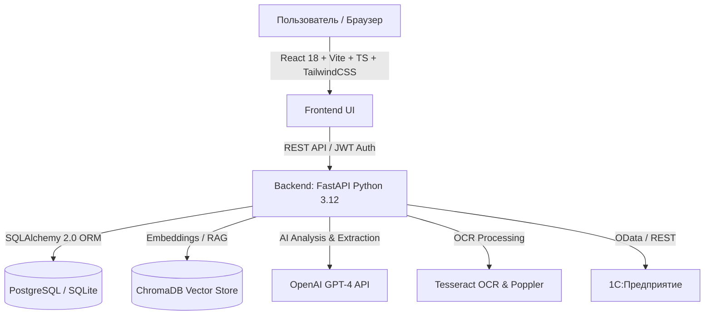

# 📑 RegAI — Полное описание проекта, функционала и возможностей

> **Версия документа:** 1.0 (Актуально на 2026 год)  
> **Статус системы:** Готова к тестовому запуску и пилоту (Pilot & Demo Ready)

---

## 🧭 1. О проекте (Executive Summary)

**RegAI** — это интеллектуальная корпоративная B2B-платформа для автоматизации финансовой трансформации, комплаенс-контроля и нормативного анализа, разработанная для **главных бухгалтеров, аудиторов, финансовых директоров и комплаенс-офицеров**.

### Главная проблема, которую решает платформа:
1. **Трудоемкая трансформация отчетности:** Ручной перевод балансов из национальных стандартов бухучета (MCFO/НСБУ) в международные стандарты (МСФО / IFRS) занимает у бухгалтеров от 3 до 7 дней на каждый отчетный период и сопровождается высоким риском человеческих ошибок.
2. **Сложность отслеживания регуляторных изменений:** Постоянные изменения в налоговом законодательстве, стандартах МСФО и отраслевых требованиях требуют сотен часов юридического и аудиторского анализа.
3. **Рутинная обработка первичных документов:** Ручной ввод данных из PDF-инвойсов, договоров и актов отнимает драгоценное время специалистов.
4. **Разрозненность данных и отсутствие прозрачного аудита:** Сложно отследить, кто, когда и на каком основании внес изменения или реклассификационные проводки в финансовые отчеты.

### Ключевая ценность RegAI:
- **Сокращение времени трансформации с дней до минут** за счет автоматического маппинга счетов и балансовой валидации.
- **ИИ-ассистент по регуляциям (RAG)** с мгновенным поиском и скорингом влияния новых законов на конкретный бизнес.
- **Умный OCR первичных документов** с автоматическим извлечением реквизитов, сумм и товарных позиций в структурированный JSON/БД.
- **Сквозной аудиторский след (Audit Trail)** каждого действия пользователя для полной прозрачности перед проверяющими органами.
- **Прямая интеграция с 1С:Предприятие** через OData API.

---

## 🏗️ 2. Технологический стек и архитектура



- **Frontend:** React 18, TypeScript, Vite, TailwindCSS, Lucide Icons, Recharts, i18next (поддержка мультиязычности: Русский, English, Монгольский).
- **Backend:** Python 3.12, FastAPI, Pydantic v2, SQLAlchemy 2.0, Alembic (миграции БД), AsyncPG / Psycopg3.
- **Искусственный интеллект и семантический поиск:** ChromaDB, LangChain/OpenAI RAG, GPT-4, токенизация tiktoken.
- **Обработка документов:** Tesseract OCR (распознавание сканов и изображений), `pdf2image`, `PyPDF2`/`pypdf`, `openpyxl` (Excel), `pandas`.
- **Инфраструктура и развертывание:** Docker, Docker Compose, Nginx, Prometheus метрики (`/metrics`).

---

## 👥 3. Ролевая модель и безопасность (RBAC & Multi-Tenancy)

Платформа поддерживает строгую ролевую модель и изоляцию данных:

| Роль | Область доступа | Ключевые права |
| :--- | :--- | :--- |
| **Суперадмин (Superadmin)** | Вся платформа (все тенанты и компании) | Управление организациями-клиентами (Tenants), глобальными справочниками, системными настройками и всеми пользователями. |
| **Администратор компании (Admin)** | Конкретная компания / холдинг | Управление сотрудниками компании, назначение ролей, настройка профиля компании и интеграции с 1С. |
| **Бухгалтер (Accountant)** | Финансовый контур компании | Загрузка и ручной ввод балансов, трансформация MCFO ↔ IFRS, внесение корректировок, загрузка первичных документов. |
| **Аудитор (Auditor)** | Аудиторский контур компании | Просмотр трансформаций и балансов (read-only), проверка комплаенс-требований, валидация корректировок, просмотр журнала аудита. |

---

## ⚡ 4. Полный перечень функционала (Что работает прямо сейчас)

### 📊 Модуль 1: Интерактивный Дашборд (Dashboard)
- **Сводные метрики в реальном времени:** текущий комплаенс-скоринг компании, количество активных отчетов, статусы предупреждений и дедлайны.
- **Лента последних событий:** фиксация недавних загрузок, изменений балансов и проверок.
- **Быстрые действия (Quick Actions):** переход к трансформации, созданию отчета или загрузке документа в один клик.

---

### 🔄 Модуль 2: Финансовая трансформация (MCFO ↔ IFRS Transformation)
1. **Ввод исходного баланса:**
   - **Через Excel:** Загрузка готового файла баланса (в комплекте идет преднастроенный шаблон `balance_sheet_template.xlsx`).
   - **Ручной ввод:** Удобный табличный интерфейс со структурированием по категориям (*Внеоборотные активы, Оборотные активы, Краткосрочные обязательства, Долгосрочные обязательства, Капитал*).
   - **Автоматическая валидация:** Мгновенный расчет балансового уравнения $Активы = Обязательства + Капитал$. Подсветка расхождений при наличии ошибок.
2. **Движок трансформации (Transformation Engine):**
   - Автоматическая реклассификация статей национального плана счетов в стандарты МСФО (IFRS).
   - Расчет агрегированных показателей для международной отчетности.
3. **Модуль ручных аудиторских корректировок (Adjustments):**
   - Возможность добавить реклассификационную проводку (Дебет / Кредит).
   - Указание суммы, описания причины корректировки и привязка к конкретному стандарту МСФО (например, *МСФО (IFRS) 16 «Аренда»* или *МСФО (IAS) 16 «Основные средства»*).
   - Автоматический пересчет итогового МСФО-баланса с учетом внесенных правок.
4. **Сравнение и экспорт результатов:**
   - Наглядное сопоставление балансов «До» и «После» (Side-by-side view).
   - Экспорт в Excel и JSON.

---

### 📚 Модуль 3: Умная база регуляций и семантический поиск (RAG Regulations)
- **База знаний из 89 нормативных актов:** Включает МСФО (IFRS / IAS), Налоговый кодекс, GDPR / Закон о ПДн, стандарты ESG, регуляции в сфере кибербезопасности и финансового контроля.
- **ИИ-поиск на естественном языке:** Поиск не просто по ключевым словам, а по смыслу запроса (например: *"Как учитывать операционную аренду?"*, *"Требования к резервам по сомнительным долгам"*).
- **Фильтрация и классификация:** По юрисдикциям, категориям (Tax, IFRS, Privacy, ESG), дате вступления в силу и статусу.
- **Детальная карточка регуляции:** Полный текст стандарта, требования, контрольные шаги выполнения.

---

### 🧠 Модуль 4: Анализ нормативного воздействия (Regulatory Impact Analysis)
- **ИИ-скоринг регуляторного влияния:** Оценка от 1 до 10 степени влияния выбранного стандарта/закона на конкретную компанию с учетом ее отрасли, размера и специфики.
- **Резюме для руководства:** Генерация краткого аналитического отчета на базе GPT-4.
- **Пошаговый план действий (Action Items):** Автоматическое формирование списка конкретных задач, которые компании необходимо выполнить для соответствия стандарту.

---

### 📄 Модуль 5: Умное распознавание документов (Smart Document OCR)
- **Поддержка форматов:** PDF (включая сканированные и многостраничные), PNG, JPG, TIFF.
- **OCR-распознавание:** Локальный движок Tesseract OCR + Poppler.
- **ИИ-извлечение сущностей по типам документов:**
  - **Счета-фактуры / Инвойсы (Invoices):** Номер счета, дата выставления, срок оплаты, продавец, покупатель, валюта, итоговая сумма, НДС, список товарных позиций (наименование, кол-во, цена, сумма).
  - **Договоры (Contracts):** Номер и наименование договора, стороны, дата вступления в силу, срок действия, сумма контракта, ключевые условия и обязательства.
  - **Банковские выписки (Bank Statements):** Номер счета, период выписки, входящий/исходящий остаток, обороты по дебету и кредиту, список транзакций.
- Сохранение распознанных данных в базе для дальнейшего аудита.

---

### 🔌 Модуль 6: Двусторонняя интеграция с 1С:Предприятие 8.3 (Two-Way 1C OData Connector)
- **Протокол подключения:** Стандартный OData v4 и REST API `1С:Предприятие 8.3` (регистр бухгалтерии `AccountingRegister_Хозрасчетный`, план счетов `ChartOfAccounts_Хозрасчетный` и `Document_ОперацияБух`).
- **Безопасность и шифрование учетных данных:**
  - Поддержка Basic Auth и Bearer Token / API Key.
  - Шифрование паролей и токенов в базе данных с использованием **Fernet / AES-256**.
  - Переключатель проверки SSL-сертификатов (для работы с локальными серверами 1С).
  - Тестирование соединения и замер задержки сети (Latency Ping в мс).
- **Прямой импорт (1С ➔ RegAI):**
  - Извлечение оборотно-сальдовой ведомости (ОСВ / Trial Balance) и оборотов по счетам с фильтрацией по организации (`Организация`) и периодам.
  - Нормализация плана счетов РСБУ (счета 01, 02, 10, 20, 41, 50, 51, 60, 62, 66, 67, 70, 80, 84 и др.) и автоматическое наполнение баланса RegAI с проверкой сходимости ($Активы = Обязательства + Капитал$).
- **Обратная выгрузка (RegAI ➔ 1С — Pushback):**
  - Экспорт утвержденных МСФО-корректировок напрямую в 1С в виде документа `Document_ОперацияБух` (ручные бухгалтерские проводки с дебетом, кредитом, суммами и комментариями).
- **Журнал синхронизации и аудит (Sync Logs):**
  - Фиксация каждой операции синхронизации с указанием времени, пользователя, статуса (`SUCCESS`, `PARTIAL`, `FAILED`), количества обработанных записей и длительности в миллисекундах.
- **Оффлайн/Демо-режим (Mock Fallback):** Встроенные реалистичные фикстуры 1С OData для автономной демонстрации возможностей клиентам.


---

### ✅ Модуль 7: Комплаенс-контроль и оценка рисков (Compliance & Scoring)
- **Чек-листы соответствия:** Интерактивное отслеживание статусов выполнения нормативных требований (*Compliant*, *Pending*, *Non-Compliant*).
- **Оценка комплаенс-скоринга:** Расчет общего индекса надежности и соответствия требованиям регуляторов.
- **Управление свидетельствами (Evidence):** Прикрепление подтверждающих документов к пунктам проверки.
- **Уведомления о дедлайнах:** Предупреждения о приближающихся сроках сдачи налоговых и финансовых отчетов.

---

### 📝 Модуль 8: Управление отчетностью и шаблонами (Reports)
- **Каталог шаблонов:** Готовые формы финансовых и регуляторных отчетов.
- **Жизненный цикл документа:** Полноценный воркфлоу согласования (*Черновик → На проверке → Утвержден*).
- **Совместная работа:** Встроенная система аудиторских комментариев и замечаний к отчетам.
- **Экспорт:** Формирование печатных форм и выгрузка.

---

### 🛡️ Модуль 9: Журнал аудита (Audit Trail & Activity Logs)
- Непрерывное протоколирование каждого значимого события в системе:
  - Авторизация и выход пользователей.
  - Создание, редактирование и удаление балансов.
  - Внесение корректировок трансформации.
  - Загрузка и удаление документов.
  - Синхронизация с 1С.
  - Экспорт данных.
- Фиксация пользователя, роли, IP-адреса, даты/времени, типа ресурса и статуса операции (Успешно / Ошибка).

---

### 🏢 Модуль 10: Управление компаниями и визуализация холдинга
- **Карточки компаний:** Реквизиты, отрасль, юрисдикция, описание бизнеса.
- **Иерархическое дерево (Hierarchy Tree):** Наглядное отображение структуры холдинга (материнские компании, дочерние структуры, филиалы).
- **Налоговые конфигурации (Tax Config):** Управление ставками корпоративного налога, НДС и соцвзносов по регионам.

---

### 📖 Модуль 11: Встроенные обучающие материалы и примеры
- Прямо в интерфейсе доступны готовые справочные разделы:
  - **Интерактивное руководство (`/guide`):** Пошаговый туториал по всем возможностям.
  - **Готовые примеры (`/examples`):** Шаблоны балансов, примеры заполнения и трансформаций.
  - **Центр помощи (`/help`):** База знаний с ответами на частые вопросы пользователей.

---

## 🔑 5. Готовые демонстрационные учетные записи

Для удобства тестирования в базу данных уже зашита готовая компания **TechCorp** с пользователями под каждую роль:

| Роль в системе | Логин (Email) | Пароль | Сценарий демонстрации |
| :--- | :--- | :--- | :--- |
| 👑 **Суперадмин платформы** | `admin@example.com` | `admin123` *(или `ChangeMe123!`)* | Демонстрация администрирования, создание новых тенантов, компаний и глобальное управление. |
| 💼 **Бухгалтер компании** | `test.accountant@techcorp.com` | `password` | Демонстрация ввода баланса, загрузки Excel, трансформации в МСФО и распознавания сканов. |
| 🔍 **Аудитор компании** | `auditor@techcorp.com` | `password` | Демонстрация комплаенс-проверок, валидации баланса, анализа корректировок и журнала аудита. |
| 🏢 **Администратор TechCorp** | `admin@techcorp.com` | `password` | Демонстрация управления сотрудниками компании и настройки интеграции с 1С. |

---

## 🚀 6. Как запустить систему для показа или тестирования

### Рекомендуемый запуск через Docker (1 команда):
```bash
cd regai
docker compose -f ops/compose/docker-compose.dev.yml up --build
```
- **Веб-интерфейс:** `http://localhost:5173`
- **Документация API (Swagger):** `http://localhost:8000/docs`

---

## 🔮 7. Дорожная карта дальнейшего развития (Roadmap)

В следующих версиях платформы запланировано:
1. **Генерация полного пакета примечаний к МСФО-отчетности (IFRS Disclosures)** на основе ИИ.
2. **Двусторонняя запись в 1С** (выгрузка скорректированных проводок обратно в базу 1С).
3. **Поддержка OIDC / SSO (Active Directory / Keycloak / Google Workspace)** для бесшовного входа сотрудников корпорации.
4. **Конструктор кастомных правил реклассификации счетов** (No-code Mapping Rule Builder).
